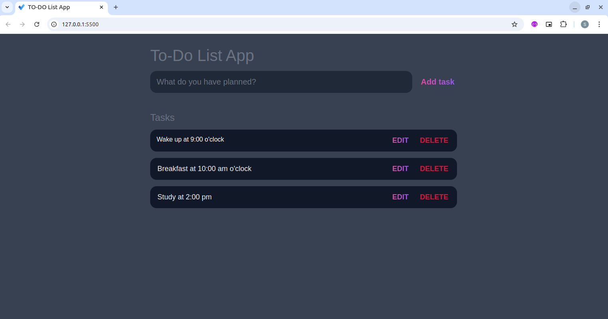

# To-Do List Application

## Screenshot

This project is a To-Do List app built with [HTML](https://developer.mozilla.org/en-US/docs/Web/HTML), [CSS](https://developer.mozilla.org/en-US/docs/Web/CSS), and [JavaScript](https://developer.mozilla.org/en-US/docs/Web/JavaScript) that helps users organize and manage tasks. The app provides a simple interface to add, edit, and delete tasks, with the ability to mark tasks as complete. It features a clean, responsive design that works across different devices, making it easy for users to track their progress. JavaScript handles task management, updates the display in real-time, and stores tasks locally so they persist even after a page refresh.

## 🛠 Built With

+ `CSS`
+ `HTML`
+ `Javascript`
